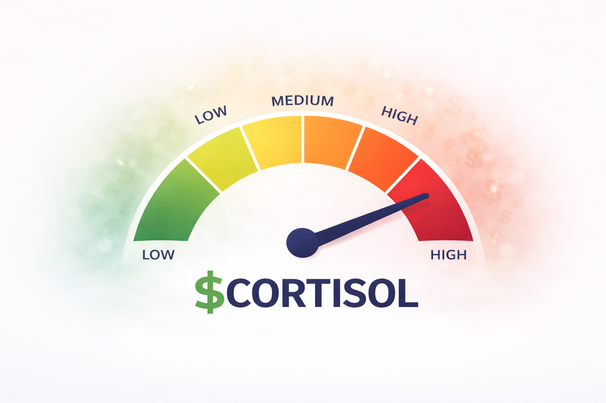

# $CORTISOL Discord Bot

A 24/7 Discord bot for the $CORTISOL community server.



## Features

- 🤖 **Auto-poster** - Posts promotional content hourly
- 💰 **Price Alerts** - Updates every 15 minutes with price from DexScreener
- 👋 **Welcome Messages** - Greets new members automatically
- 🎫 **Auto-role** - Assigns "Holder" role to new members
- 📊 **Commands**:
  - `!price` - Get current price & stats
  - `!buy` - Get buy links
  - `!links` - All social links
  - `!help` - Help menu
  - `!clear` - Clear messages (mod)

## Bot Profile Picture

Use `bot-icon.png` as the bot's profile picture:
1. Go to https://discord.com/developers/applications
2. Select your application
3. Go to "General Information"
4. Upload `bot-icon.png` as the app icon

## Setup

1. **Install dependencies:**
```bash
pip install -r requirements.txt
```

2. **Create .env file:**
```env
DISCORD TOKEN=your_bot_token_here
ANNOUNCEMENTS CHANNEL=channel_id
GENERAL CHANNEL=channel_id
PROMOS CHANNEL=channel_id
```

3. **Get Discord Bot Token:**
   - Go to https://discord.com/developers/applications
   - Create new application
   - Go to Bot → Reset Token
   - Enable MESSAGE CONTENT INTENT

4. **Get Channel IDs:**
   - Enable Developer Mode in Discord
   - Right-click channel → Copy ID

5. **Run locally:**
```bash
python main.py
```

## Hosting 24/7 (Free)

### Option 1: Railway (Recommended)
1. Create a new GitHub repo and push this code
2. Go to railway.app → New Project → Deploy from GitHub
3. Add environment variables in Railway dashboard
4. Free tier: 500 hours/month (enough for 24/7)

### Option 2: Fly.io
1. Install flyctl
2. `fly launch`
3. Add secrets: `fly secrets set DISCORD_TOKEN=xxx`
4. `fly deploy`

## Add Bot to Your Server

1. Go to https://discord.com/developers/applications
2. Select your application
3. Go to "OAuth2" → "URL Generator"
4. Select scopes: `bot`
5. Select permissions:
   - Send Messages
   - Manage Messages
   - Add Reactions
   - Manage Roles
   - Read Messages/View Channels
6. Copy the generated URL
7. Open URL and select your server

## Bot Permissions

Required intents:
- Message Content Intent
- Server Members Intent

Required permissions:
- Send Messages
- Manage Messages
- Add Reactions
- Manage Roles
